<div align="center">

# R2S: real-to-sim physics from a robot's own logs

**Turn joint torques (or a wrist force/torque sensor) and camera images into the mass, centre of mass,<br>
inertia and friction of the objects a robot handled, each checked against ground truth.**

[The finding](#the-finding-in-one-picture) · [How it works](#how-it-works) · [Try it](#try-it) · [Evidence](#the-evidence) · [RH20T demo](#6-real-robot-episodes-rh20t) · [Repository map](#repository-map) · [Setup](#setup) · [References](#references)

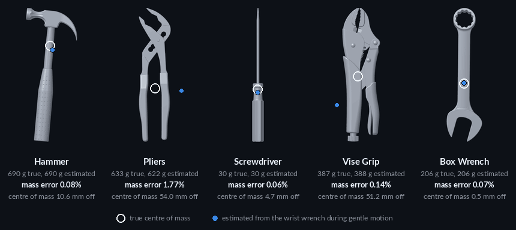

<sub><b>Weighing objects by holding them.</b> The pipeline's self-test on five tools with CAD ground truth: mass is within 2% on all five from gentle motion alone;<br>the centre of mass is within about 1 cm on three and about 5 cm off on two.</sub>

<br>

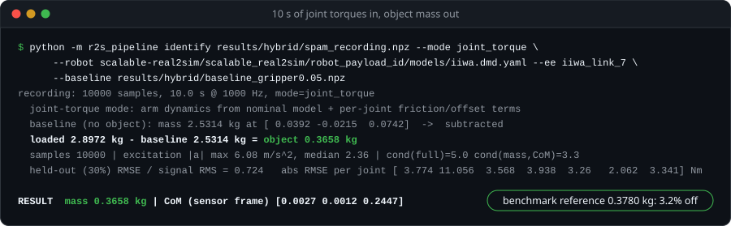

<sub><b>On a real robot, with no force sensor.</b> Ten seconds of KUKA iiwa joint torques and the nominal robot model give the mass of a can of Spam to 3.2%.<br>The recording is in this repository; the command and output are real.</sub>

<br>

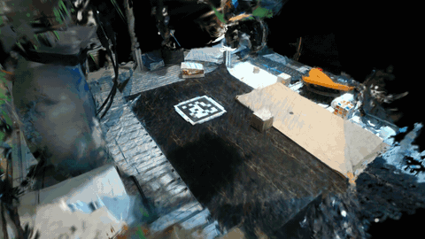 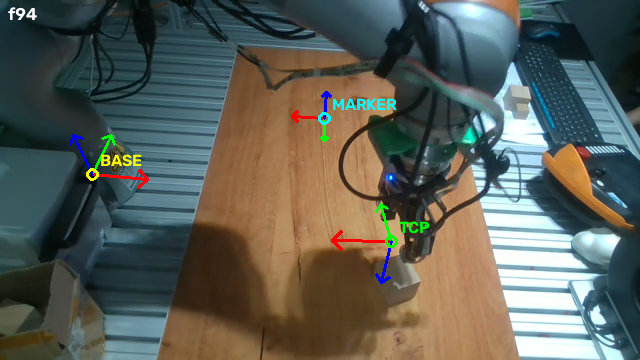

<sub><b>And the scene around it.</b> Left: a robot workspace rebuilt as a Gaussian splat from the dataset's own calibrated cameras, seen along a path no camera took.<br>Right: the same rig mid-grasp, with the base, marker and tool frames projected in to check every calibration convention. (RH20T, CC BY-SA 4.0)</sub>

</div>

A simulator needs four numbers per object: mass, centre of mass, inertia, friction. They are usually guessed. This
repository asks whether a robot's ordinary interaction logs can supply them instead, tests that claim against two published
methods [[1]](#references) [[2]](#references) and ground-truth data [[3]](#references), and ships the pipeline that came out of it: [`r2s_pipeline`](r2s_pipeline/).

> **Status (September 2026): research code.** Every number below is measured and traceable to a file in
> [`results/`](results/); the day-by-day record is in the [lab notebook](docs/LAB_NOTEBOOK.md).

## The finding in one picture

<picture>
  <source media="(prefers-color-scheme: dark)" srcset="docs/figures/identifiability-dark.svg">
  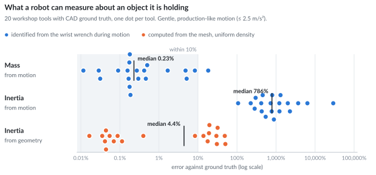
</picture>

- **Mass comes from motion, and gentle motion is enough.** 0.23–0.98% median error, even from the gentlest 10% of samples (≤ 0.39 m/s²).
- **Inertia does not come from motion.** 300–800% median error and 0 of 20 objects within 10%, with a perfect model and no added noise.
- **Inertia comes from geometry.** A uniform-density mesh gives 4.4% median error (12% on a coarse vision-reconstructed mesh).

So the pipeline routes each parameter to the channel that can actually identify it:

| Quantity | From robot motion / torque | From reconstructed geometry | What the pipeline does |
|---|---|---|---|
| Mass | **0.23–0.98% median error** | not available | identify from torque or wrench |
| Centre of mass | 3.6–8 mm median | 1.0 mm (CAD mesh) | either; geometry when the mesh is good |
| Inertia | **300–800% error, 0/20 within 10%** | **4.4% median** (CAD mesh), 12% (vision mesh) | geometry plus a density prior |

### Why it splits that way

<picture>
  <source media="(prefers-color-scheme: dark)" srcset="docs/figures/signal_budget-dark.svg">
  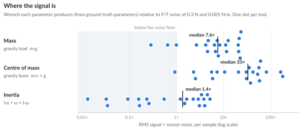
</picture>

Gravity does the work. Holding an object loads the sensor with its full weight (mass) and its weight times a lever arm
(centre of mass), whether or not the arm moves. Inertia only shows up multiplied by angular acceleration, and at handling
speeds that term is about 3% of the torque signal and sits at the noise floor of an F/T sensor. No choice of solver recovers
a quantity the measurement barely contains. ([`signal_budget.py`](experiments/ground_truth/signal_budget.py),
[`results/utias_signal_budget.json`](results/utias_signal_budget.json))

## How it works

<picture>
  <source media="(prefers-color-scheme: dark)" srcset="docs/figures/pipeline-dark.svg">
  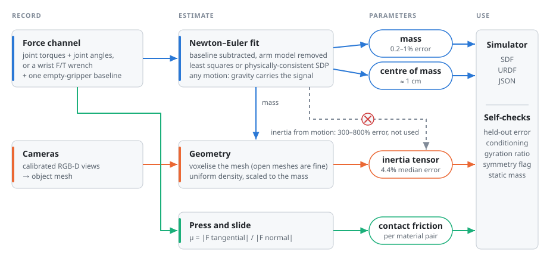
</picture>

Record the robot holding the object (and once holding nothing), reconstruct the object's mesh from the cameras, and each
parameter is estimated from the channel that carries it. The output drops straight into an SDF or URDF, with self-checks
that flag a bad recording without needing ground truth.

## Try it

The pipeline is one package with a command line. Its self-test needs no robot: it runs on ground-truth data and fails loudly
if the install is wrong (setup is [below](#setup)).

```console
$ python -m r2s_pipeline selftest
self-test on utiasSTARS synthetic data with known ground truth (wrench mode)

== Hammer ==
  wrench convention: expressed in WORLD frame, REACTION (object on sensor) -> negated; static-gravity agreement 1.000; static mass estimate 0.6865 kg
  samples 1000 | excitation |a| max 1.01 m/s^2, median 0.29 | cond(full)=25.0 cond(mass,CoM)=1.5
  held-out (30%) RMSE / signal RMS = 3.565   abs RMSE [0.237 0.344 0.282] N  [0.0673 0.0917 0.0687] Nm
  geometry: 15234 voxels @ 2.6 mm, watertight=True, volume 266 cm^3 -> mean density 2590 kg/m^3 | gyration 0.68
  symmetry flag: near-degenerate principal moments -> object-frame CoM sign depends on the pose registration
  CoM (object frame) [-0.0016 -0.052  -0.0073] | 56.8 mm from geometric centroid
  vs truth: mass 0.08%  CoM 10.6 mm  geometry-inertia 14.4%  -> PASS

[... Pliers, Screwdriver, Vise_Grip, Box_Wrench ...]

SELF-TEST PASSED
```

Five tools, mass error 0.06–1.8%.

**On real robot data.** A 10 s recording of a KUKA iiwa holding a can of Spam, and the matching empty-gripper baseline, are
in the repository ([`results/hybrid/`](results/hybrid/), from the Scalable Real2Sim benchmark). Joint torques only, nominal
robot model, two seconds to run:

```console
$ python -m r2s_pipeline identify results/hybrid/spam_recording.npz --mode joint_torque \
      --robot scalable-real2sim/scalable_real2sim/robot_payload_id/models/iiwa.dmd.yaml --ee iiwa_link_7 \
      --baseline results/hybrid/baseline_gripper0.05.npz
recording: 10000 samples, 10.0 s @ 1000 Hz, mode=joint_torque
  joint-torque mode: arm dynamics from nominal model + per-joint friction/offset terms
  baseline (no object): mass 2.5314 kg at [ 0.0392 -0.0215  0.0742]  ->  subtracted
  loaded 2.8972 kg - baseline 2.5314 kg = object 0.3658 kg
  samples 10000 | excitation |a| max 6.08 m/s^2, median 2.36 | cond(full)=5.0 cond(mass,CoM)=3.3
  held-out (30%) RMSE / signal RMS = 0.724   abs RMSE per joint [ 3.774 11.056  3.568  3.938  3.26   2.062  3.341] Nm

RESULT  mass 0.3658 kg | CoM (sensor frame) [0.0027 0.0012 0.2447]
```

The benchmark's reference mass is 0.3780 kg, so this is 3.2% off. Drop `--baseline` and the 2.53 kg gripper lands in the
payload estimate, which is why the empty-gripper recording is the most important item in the
[recording spec](recording/RECORDING_SPEC.md). Add `--mesh object.obj` to get the inertia tensor and ready-to-paste
SDF/URDF `<inertial>` blocks.

From Python:

```python
from r2s_pipeline import identify, load_recording, sdf_inertial_block

res = identify(load_recording("rec.npz"), mesh_path="obj.obj", baseline=load_recording("empty.npz"))
print(res["mass"], res["com_object_frame"], res["diagnostics"]["gyration_ratio"])
print(sdf_inertial_block(res))
```

What the package does ([details](r2s_pipeline/README.md)):

- two sensing modes: a wrist wrench, or joint torque through Drake [[7]](#references) with any URDF;
- automatic wrench-convention detection and empty-gripper baseline subtraction;
- mass and centre of mass from motion, inertia from geometry, friction from a press-and-slide motion;
- self-checks that need no ground truth: held-out torque error, conditioning, gyration ratio, symmetry warning;
- JSON, SDF and URDF output.

Recording your own data: [`recording/RECORDING_SPEC.md`](recording/RECORDING_SPEC.md) (any robot) and
[`recording/MED7_RECORDING.md`](recording/MED7_RECORDING.md) (KUKA LBR Med7 over the LBR-Stack FRI driver [[11]](#references): joint torque sensors, no wrist F/T needed).

## The evidence

Six experiments led to that design. Each section below gives the result first; the full tables are one click away.

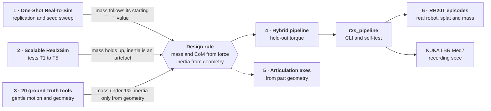

### 1. One-Shot Real-to-Sim does not identify mass from a push

*Zhu et al., RA-L 2025 [[1]](#references) ([arXiv:2412.00259](https://arxiv.org/abs/2412.00259) v4; code: RigidWorldModel).*

<picture>
  <source media="(prefers-color-scheme: dark)" srcset="docs/figures/oneshot_seed-dark.svg">
  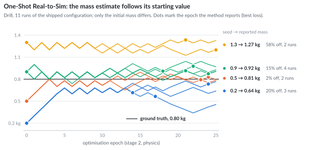
</picture>

The final mass tracks the *initial seed* (0.5 → 0.81, 0.9 → 0.92, 1.3 → 1.27 kg). The optimiser anchors on initialisation
and the data exerts almost no pull, so a better seed (from a VLM, say) moves the answer without making it more correct.

<details>
<summary><b>Details: replication, sweep and scripts</b></summary>

- Environment rebuilt from scratch (conda, Python 3.9, torch 2.1 + CUDA 12.1, pytorch3d from source); seven fixes the upstream
  README does not mention are listed in the [lab notebook](docs/LAB_NOTEBOOK.md).
- 3-seed replication of the shipped (paper v4) configuration on the Drill: **mass error 0.162 kg (20.2%), s.d. 0.087**.
- 8-run initialisation sweep, ground truth 0.8 kg / friction 0.5:

  | Seed (mass, friction) | Runs | Reported mass | Mass error | Reported friction |
  |---|---|---|---|---|
  | 0.2 kg, 0.2 (shipped) | 3 | 0.638 kg | 20.2% | 0.672 |
  | 0.5 kg, 0.2 | 2 | 0.811 kg | 2.2% | 0.605 |
  | 0.9 kg, 0.2 | 2 | 0.925 kg | 15.6% | 0.425 |
  | 1.3 kg, 0.2 | 2 | 1.267 kg | 58.4% | 0.282 |
  | 0.9 kg, 0.4 ("VLM" seed) | 2 | 0.912 kg | 14.0% | 0.476 |

  The figure pools the four runs seeded at 0.9 kg.
- Inertia is a bounding-box formula, not the mesh the method itself reconstructs.
- Scripts: [`experiments/oneshot/`](experiments/oneshot/) (`run_phase0.sh`, `run_v4_replication.sh`, `run_sweep.sh`, the
  `*_report.py` readers, and the raw logs). Per-epoch traces: [`results/oneshot_traces.json`](results/oneshot_traces.json).

</details>

### 2. Scalable Real2Sim: mass holds up, its inertia output is an artefact

*Pfaff et al., IROS 2025 [[2]](#references) ([arXiv:2503.00370](https://arxiv.org/abs/2503.00370)); tests T1–T5 on spam / sugar / lego.*

<picture>
  <source media="(prefers-color-scheme: dark)" srcset="docs/figures/s2s_excitation-dark.svg">
  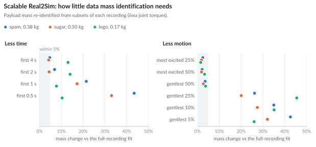
</picture>

Mass is stable down to the gentlest half of the samples (≤ 3.7% drift) and collapses below a quarter. The inertia the method
ships is about 0.025 kg·m² on two axes for *every* object, including a 169 g Lego brick: a robot-model artefact, not the object.

<details>
<summary><b>Details: tests T1 to T5</b></summary>

| Test | Result |
|---|---|
| T1 reproduce shipped mass | **PASS** to 6 decimals on all 3 objects |
| T2 mass with less excitation | stable down to the gentlest 50% of samples (≤ 3.7% drift); collapses below 25%. `cond(W)` is a ground-truth-free identifiability check (~5 healthy, > 20 failing) |
| T3 inertia source | geometry-derived inertia beats torque-identified inertia on held-out torque, 3/3 objects; the shipped inertia is ~0.025 kg·m² on two axes for *every* object |
| T4 bounding-ellipsoid option | no effect (0.0%), and its code path is broken on current Drake |
| T5 held-out torque | good on joints 0–4; no signal on wrist joints 5–6 |

The released benchmark contains **no object with ground-truth physics** (the paper's 3D-printed calibration object is not in
it), so inertia accuracy cannot be validated from its public data.

Script and results: [`experiments/scalable_real2sim/s2s_tests.py`](experiments/scalable_real2sim/s2s_tests.py),
[`results/s2s_tests.json`](results/s2s_tests.json).

</details>

### 3. Ground truth: 20 workshop tools

*The utiasSTARS workshop-tools dataset of Nadeau et al. [[3]](#references): CAD meshes, material assignments, and CAD-derived mass, centre of mass and inertia.*

<picture>
  <source media="(prefers-color-scheme: dark)" srcset="docs/figures/tools_scorecard-dark.svg">
  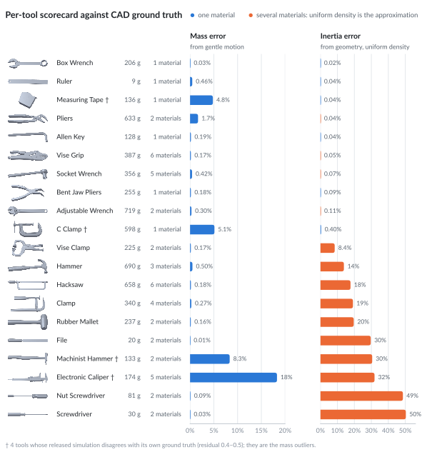
</picture>

Mass from gentle motion is within 0.5% for 15 of the 20 tools, and four of the other five are tools whose released
simulation disagrees with its own ground truth. Geometry-derived inertia is essentially exact when a tool is one material or
several of similar density (steels, brass), and 8–50% off when densities differ (a steel blade in a PVC handle). That
residual is where a material or part prior helps.

<details>
<summary><b>Details: identification from gentle motion</b></summary>

Wrist-wrench Newton–Euler regressor [[5]](#references), fit on the first 70% of each recording by least squares or with the
physical-consistency constraint of Wensing et al. [[6]](#references) ("SDP"), and evaluated on the held-out 30%:

| Setting | Mass median | Mass ≤ 5% | CoM median | Inertia median | Inertia ≤ 10% |
|---|---|---|---|---|---|
| clean, least squares | 0.23% | 17/20 | 8.0 mm | 786% | 0/20 |
| clean, physically-consistent SDP | 0.27% | 16/20 | 8.3 mm | 303% | 0/20 |
| + 0.3 N / 0.005 N·m noise | 0.78% | 14/20 | 15.9 mm | 852% | 0/20 |
| gentlest 10% of motion (≤ 0.39 m/s²), noisy | 0.98% | not computed | 3.6 mm | 4272% | not computed |

Uniform-density geometry inertia against ground truth: Frobenius error median **4.4%** on the CAD mesh (0.0% for
single-material tools, 18.4% median for multi-material ones) and 12% on coarse vision-reconstructed meshes.

Under noise the failures are the objects below 50 g (a 20 g file, a 9 g ruler), where the weight is the size of the sensor
noise.

Scripts and results: [`experiments/ground_truth/`](experiments/ground_truth/),
[`results/utias_gentle_motion.json`](results/utias_gentle_motion.json),
[`results/utias_geometry_inertia.json`](results/utias_geometry_inertia.json).

</details>

### 4. The hybrid pipeline: same mass, a usable inertia

*Mass and centre of mass from torque (SDP), inertia from the voxelised mesh.*

<picture>
  <source media="(prefers-color-scheme: dark)" srcset="docs/figures/hybrid_inertia-dark.svg">
  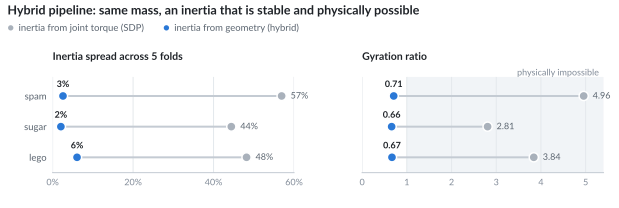
</picture>

Torque prediction is insensitive to the inertia source for objects under 0.5 kg. That is exactly why torque-identified
inertia is meaningless there, and why taking it from geometry costs nothing in held-out accuracy.

<details>
<summary><b>Details: 5-fold held-out torque reconstruction</b></summary>

Mean over spam / sugar / lego:

| Method | rel. RMSE joints 0–4 | abs. RMSE (N·m) | mass CV | inertia CV across folds | gyration ratio |
|---|---|---|---|---|---|
| torque only | 0.1111 | 0.436 | 3.6% | 50% | 3.87 (physically impossible) |
| hybrid | 0.1102 | 0.439 | 3.6% | **4%** | **0.68** |
| hybrid + geometric CoM | **0.1065** | **0.422** | 3.6% | 4% | 0.68 |

The gyration ratio is the radius of gyration over half the longest extent: real bodies sit around 0.5–0.8, and anything
above 1 would need mass outside the object.

Scripts and results: [`experiments/scalable_real2sim/hybrid_pipeline.py`](experiments/scalable_real2sim/hybrid_pipeline.py),
[`eval_holdout.py`](experiments/scalable_real2sim/eval_holdout.py), [`results/hybrid/`](results/hybrid/).

</details>

### 5. Articulation axes from geometry

*A synthetic stand-in for PartNet-Mobility [[10]](#references): five jointed objects with exact ground-truth axes.*

<picture>
  <source media="(prefers-color-scheme: dark)" srcset="docs/figures/axis_recovery-dark.svg">
  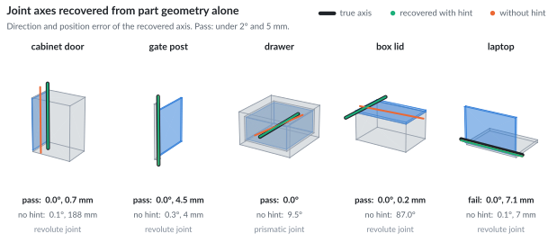
</picture>

**4 of 5 pass** (direction under 2°, position under 5 mm), identically with mesh noise and dropped faces. The laptop's
barrel hinge fails structurally: its axis lies on no contact surface, so it needs interaction or a learned prior. A one-word
semantic hint ("lid", "vertical") is what separates a correct axis from the wrong edge on face-like contacts.

Script and results: [`experiments/articulation/axis_recovery_test.py`](experiments/articulation/axis_recovery_test.py),
[`results/axis_recovery.log`](results/axis_recovery.log), [`results/axis_test/`](results/axis_test/) (URDF + OBJ).

### 6. Real-robot episodes (RH20T)

*Gaussian-splat [[8]](#references) reconstruction of an RH20T [[4]](#references) workspace from the dataset's own calibrated cameras, with no pose estimation; trained with gsplat [[9]](#references).*

<div align="center">

<br><sub>A camera path that no real camera took, through a splat trained on about a dozen calibrated views.</sub>
</div>

<br>

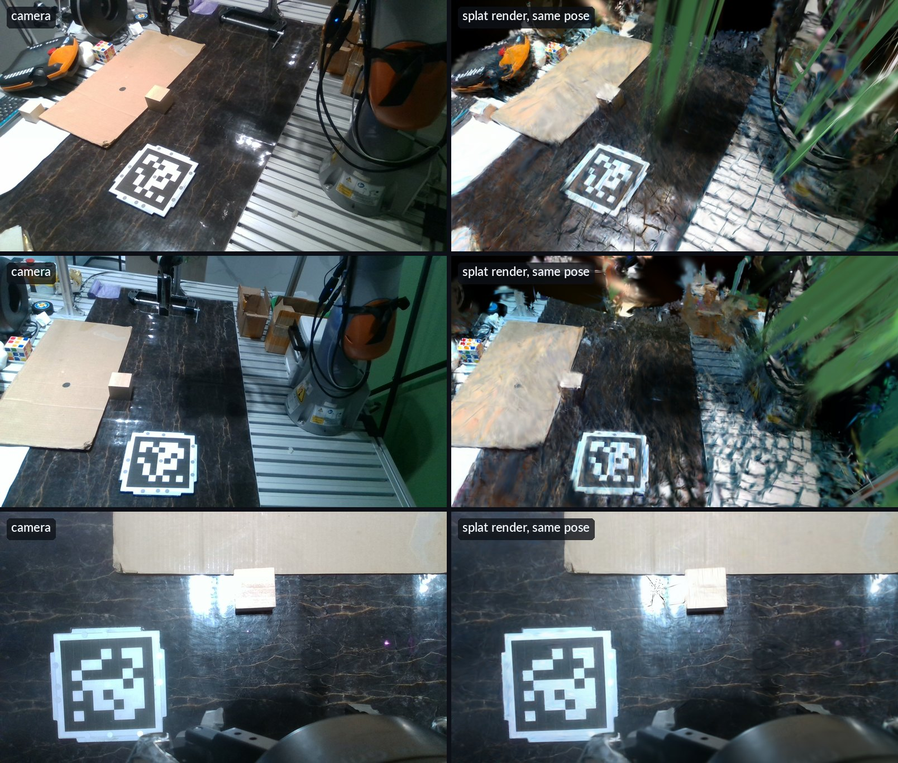

Camera images (left) and the splat rendered from the same calibrated pose (right). Two of the three cameras were held out of
training. The manipulation region reconstructs well; away from it, about a dozen views are too few and floaters appear.

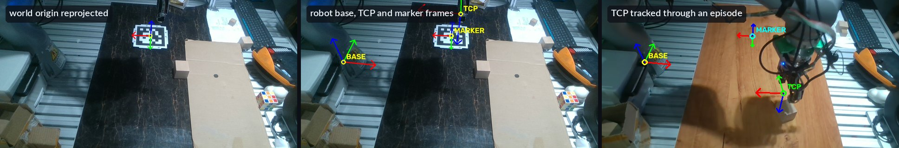

What makes that possible is getting the frames right first: every convention (extrinsics direction, base frame, in-hand
camera pose from forward kinematics) was checked by projecting a known frame into the images and looking at where it lands.

The same scripts segment the grasped object from multi-view depth, mesh it, and estimate its mass from the wrist F/T
(segmented by gripper width) and with the `r2s_pipeline` Newton–Euler fit, since teleoperated episodes have no static
plateau to average over.

All figures, the object mesh and the fused point cloud: [`results/rh20t_splat/`](results/rh20t_splat/) (derived from
RH20T scene 0001, **CC BY-SA 4.0**). Scripts: [`rh20t_splat/`](rh20t_splat/). The splat checkpoints stay local.

## Repository map

```
r2s_pipeline/             the pipeline package (python -m r2s_pipeline)
recording/                what to record and how: spec, KUKA LBR Med7 guide, recorder, URDF, calibration object
experiments/
  oneshot/                1 · One-Shot Real-to-Sim replication, seed sweep, reports, raw logs
  scalable_real2sim/      2, 4 · tests T1-T5, hybrid pipeline, K-fold held-out evaluation
  ground_truth/           3 · gentle-motion identification and signal budget on 20 ground-truth tools
  articulation/           5 · joint-axis recovery from part geometry
  materials/              differentiable material identification in Warp (pattern demo)
rh20t_splat/              6 · RH20T calibration checks, splat training, object mesh, mass from F/T
results/                  every measured result (JSON, logs, SDF, figures)
docs/
  LAB_NOTEBOOK.md         chronological notebook: environment fixes and every finding as it was made
  Setup_guide.md          the original plan and success criteria
  figures/                README figures and the scripts that build them from results/
third_party/              upstream repositories (URLs, pinned commits, licences) and our patches
```

Each folder has its own README: [`experiments/`](experiments/README.md), [`results/`](results/README.md),
[`r2s_pipeline/`](r2s_pipeline/README.md), [`recording/`](recording/README.md), [`docs/figures/`](docs/figures/README.md).

## Setup

Third-party code is not vendored. Follow [`third_party/UPSTREAM.md`](third_party/UPSTREAM.md) to clone it next to this
code at the pinned commits and apply our patches; the scripts find those clones relative to the repository root.

| Conda environment | Used for | Key versions |
|---|---|---|
| `s2s` | `r2s_pipeline`, Scalable Real2Sim tests, ground-truth tests, RH20T scripts, figures | Python 3.10, Drake 1.51.1, numpy 2.2, trimesh, gsplat |
| `rigidworldmodel` | One-Shot Real-to-Sim | Python 3.9, torch 2.1 + CUDA 12.1, pytorch3d 0.7.5 built from source |

If ROS is installed, run with `PYTHONNOUSERSITE=1` and an empty `PYTHONPATH`, for example
`env -u PYTHONPATH PYTHONNOUSERSITE=1 python -m r2s_pipeline selftest`. The exact build fixes are in the
[lab notebook](docs/LAB_NOTEBOOK.md). The self-test only needs the `utias-inertial` clone (85 MB).

## Data (not in this repository)

| Dataset | Size | Source |
|---|---|---|
| Scalable Real2Sim benchmark | 38 GB | Hugging Face `nepfaff/scalable-real2sim` |
| RH20T (cfg5, cfg7, depth, low-dim, calibration) | 126 GB | https://rh20t.github.io |
| RigidWorldModel Drill (`train1`) | 2 GB | link in the RigidWorldModel README |
| utiasSTARS workshop tools | 85 MB | included in the `utias-inertial` upstream repository |

## References

This work builds on the code and data released with [1]–[4], and on Drake [7], gsplat [9], LBR-Stack [11] and Warp [12].
BibTeX for every entry is in [`docs/references.bib`](docs/references.bib).

1. Y. Zhu, T. Xiang, A. M. Dollar and Z. Pan, "One-Shot Real-to-Sim via End-to-End Differentiable Simulation and Rendering," *IEEE Robotics and Automation Letters*, vol. 10, no. 6, pp. 6320–6327, 2025. [doi:10.1109/LRA.2025.3566623](https://doi.org/10.1109/LRA.2025.3566623) · [arXiv:2412.00259](https://arxiv.org/abs/2412.00259)
2. N. Pfaff, E. Fu, J. Binagia, P. Isola and R. Tedrake, "Scalable Real2Sim: Physics-Aware Asset Generation Via Robotic Pick-and-Place Setups," in *IEEE/RSJ International Conference on Intelligent Robots and Systems (IROS)*, 2025, pp. 6296–6303. [doi:10.1109/IROS60139.2025.11246653](https://doi.org/10.1109/IROS60139.2025.11246653) · [arXiv:2503.00370](https://arxiv.org/abs/2503.00370)
3. P. Nadeau, M. Giamou and J. Kelly, "The Sum of Its Parts: Visual Part Segmentation for Inertial Parameter Identification of Manipulated Objects," in *IEEE International Conference on Robotics and Automation (ICRA)*, 2023, pp. 3779–3785. [doi:10.1109/ICRA48891.2023.10160394](https://doi.org/10.1109/ICRA48891.2023.10160394)
4. H.-S. Fang, H. Fang, Z. Tang, J. Liu, C. Wang, J. Wang, H. Zhu and C. Lu, "RH20T: A Comprehensive Robotic Dataset for Learning Diverse Skills in One-Shot," in *IEEE International Conference on Robotics and Automation (ICRA)*, 2024, pp. 653–660. [doi:10.1109/ICRA57147.2024.10611615](https://doi.org/10.1109/ICRA57147.2024.10611615) · [arXiv:2307.00595](https://arxiv.org/abs/2307.00595)
5. C. G. Atkeson, C. H. An and J. M. Hollerbach, "Estimation of Inertial Parameters of Manipulator Loads and Links," *The International Journal of Robotics Research*, vol. 5, no. 3, pp. 101–119, 1986. [doi:10.1177/027836498600500306](https://doi.org/10.1177/027836498600500306)
6. P. M. Wensing, S. Kim and J.-J. E. Slotine, "Linear Matrix Inequalities for Physically Consistent Inertial Parameter Identification: A Statistical Perspective on the Mass Distribution," *IEEE Robotics and Automation Letters*, vol. 3, no. 1, pp. 60–67, 2018. [doi:10.1109/LRA.2017.2729659](https://doi.org/10.1109/LRA.2017.2729659)
7. R. Tedrake and the Drake Development Team, "Drake: Model-based design and verification for robotics," 2019. https://drake.mit.edu
8. B. Kerbl, G. Kopanas, T. Leimkühler and G. Drettakis, "3D Gaussian Splatting for Real-Time Radiance Field Rendering," *ACM Transactions on Graphics*, vol. 42, no. 4, 2023. [doi:10.1145/3592433](https://doi.org/10.1145/3592433)
9. V. Ye, R. Li, J. Kerr, M. Turkulainen, B. Yi, Z. Pan, O. Seiskari, J. Ye, J. Hu, M. Tancik and A. Kanazawa, "gsplat: An Open-Source Library for Gaussian Splatting," *Journal of Machine Learning Research*, vol. 26, no. 34, pp. 1–17, 2025. [jmlr.org/papers/v26/24-1476.html](http://www.jmlr.org/papers/v26/24-1476.html)
10. F. Xiang, Y. Qin, K. Mo, Y. Xia, H. Zhu, F. Liu, M. Liu, H. Jiang, Y. Yuan, H. Wang, L. Yi, A. X. Chang, L. J. Guibas and H. Su, "SAPIEN: A SimulAted Part-Based Interactive ENvironment," in *IEEE/CVF Conference on Computer Vision and Pattern Recognition (CVPR)*, 2020, pp. 11094–11104. [doi:10.1109/CVPR42600.2020.01111](https://doi.org/10.1109/CVPR42600.2020.01111) (introduces the PartNet-Mobility dataset)
11. M. Huber, C. E. Mower, S. Ourselin, T. Vercauteren and C. Bergeles, "LBR-Stack: ROS 2 and Python Integration of KUKA FRI for Med and IIWA Robots," *Journal of Open Source Software*, vol. 9, no. 103, 6138, 2024. [doi:10.21105/joss.06138](https://doi.org/10.21105/joss.06138)
12. M. Macklin, "Warp: A High-performance Python Framework for GPU Simulation and Graphics," NVIDIA GPU Technology Conference (GTC), 2022. https://github.com/NVIDIA/warp

## Citing this repository

If you use this code or these results, please cite the repository (metadata in [`CITATION.cff`](CITATION.cff)) and the
upstream work your use depends on:

```bibtex
@misc{jain2026r2s,
  author       = {Jain, Shubh},
  title        = {{R2S}: Real-to-Sim Physics from a Robot's Own Logs},
  year         = {2026},
  howpublished = {\url{https://github.com/ShubhJain007/R2S}}
}
```

## Licence

No licence has been chosen yet; until one is added, the default copyright applies. Upstream code and datasets keep their own
licences (all upstream repositories above are MIT; `robot_payload_id` has no licence file). Everything under
[`results/rh20t_splat/`](results/rh20t_splat/) is derived from RH20T and shared under CC BY-SA 4.0. The tool thumbnails in
[`docs/figures/tools/`](docs/figures/tools/) are rendered from the utiasSTARS meshes (MIT).
