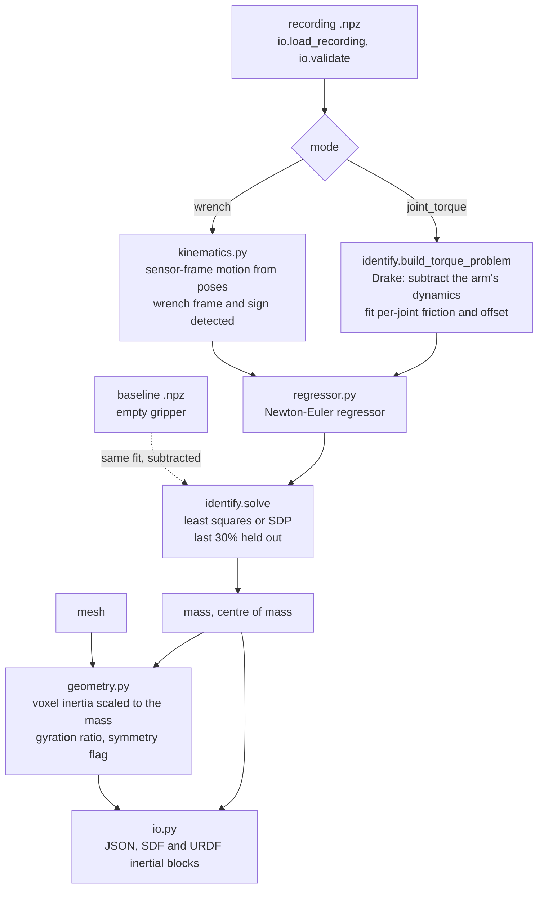

# r2s_pipeline

Object physical parameters for simulation, from a robot's own sensors.

| Parameter | Source | Validated against ground truth |
|---|---|---|
| mass, centre of mass | wrist wrench or joint torque, any motion | mass < 1%, CoM about 1 cm |
| inertia | reconstructed geometry | 4.4% median |
| contact friction | press-and-slide wrench | not yet |

Inertia is deliberately **not** taken from torque: on ground truth it is 300–800% wrong under any production-realistic
motion, and physically impossible on real objects. The evidence is in the [top-level README](../README.md#the-evidence).

## Use

```bash
python -m r2s_pipeline selftest
python -m r2s_pipeline identify rec.npz --mesh obj.obj --baseline empty.npz --out obj.json
python -m r2s_pipeline identify rec.npz --mode joint_torque --robot arm.urdf --ee flange --baseline empty.npz --mesh obj.obj
```

```python
from r2s_pipeline import identify, load_recording, sdf_inertial_block

res = identify(load_recording("rec.npz"), mesh_path="obj.obj", baseline=load_recording("empty.npz"))
```

What to record: [`../recording/RECORDING_SPEC.md`](../recording/RECORDING_SPEC.md).

Useful flags of `identify`: `--mesh-scale 0.001` for meshes in millimetres, `--sdp` for the physically-consistent fit,
`--T-so file.txt` for the mesh pose in the sensor frame, `--sdf-in a.sdf --sdf-out b.sdf` to patch an existing SDF,
`--wrench-frame` / `--wrench-sign` to override the detected convention.

## How a recording flows through it



| Module | Role |
|---|---|
| `regressor.py` | Newton–Euler regressor (Atkeson et al., 1986), parameter pack/unpack, least-squares fit and the physically-consistent SDP fit (Wensing et al., 2018) |
| `kinematics.py` | sensor-frame kinematics from poses; automatic wrench frame and sign detection |
| `geometry.py` | voxel inertia from a mesh (open meshes are fine), gyration ratio, symmetry flag |
| `identify.py` | wrench and joint-torque modes, baseline subtraction, held-out diagnostics |
| `friction.py` | contact friction from a press-and-slide motion: end-effector wrench from joint torque, then tangential over normal force |
| `io.py` | `.npz` loader and validator, JSON, SDF/URDF inertial blocks, SDF patching |
| `cli.py` | command line, and a hardware-free self-test on ground-truth data |

## Reading the diagnostics

| Output | Healthy | Meaning when it is not |
|---|---|---|
| `wrench convention` line | static-gravity agreement of 0.95 or more | a warning is printed below that: check frames, sensor bias and grasp rigidity, or force the convention with `--wrench-frame` / `--wrench-sign` |
| `cond(full)` | up to 100 | above 100 the full fit is ill-conditioned and mass and CoM are taken from a mass-and-CoM-only fit (`used_reduced_fit`) |
| `mass_train_vs_all_pct` | 5% or less | a warning is printed above that: the recording is too short or not stationary (sensor drift, grasp slip) |
| `gyration_ratio` | 0.5–0.8 | above 1 is physically impossible: something upstream (mesh scale, mass) is wrong |
| `symmetry flag` | absent | near-degenerate principal moments: the sign of the object-frame CoM depends on the pose registration |
| `holdout_rel_rmse` | lower is better | error predicting the held-out last 30% of the recording; it validates mass and CoM, not inertia |

## Install

A conda environment with Drake 1.51, numpy 2.2, scipy, trimesh and lxml (`s2s` in this project). On a machine with ROS,
run with `PYTHONNOUSERSITE=1` and `PYTHONPATH` unset:

```bash
env -u PYTHONPATH PYTHONNOUSERSITE=1 python -m r2s_pipeline selftest
```

The self-test reads the utiasSTARS data from the `utias-inertial` clone at the repository root
(see [`../third_party/UPSTREAM.md`](../third_party/UPSTREAM.md)).

## Validation record

| Test | Result |
|---|---|
| self-test (utiasSTARS, wrench mode) | mass 0.06–1.8%, 5/5 objects |
| Scalable Real2Sim spam (joint torque, nominal iiwa + baseline) | 0.366 kg against a 0.378 kg reference (3.2%) |

Full references: [top-level README](../README.md#references), BibTeX in [`../docs/references.bib`](../docs/references.bib).
