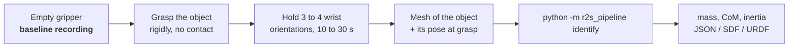

# Recording data for `r2s_pipeline`

| File | What it is |
|---|---|
| [`RECORDING_SPEC.md`](RECORDING_SPEC.md) | The data spec for any robot: signals, units, motion protocol, file format, per-object checklist |
| [`MED7_RECORDING.md`](MED7_RECORDING.md) | The same for a KUKA LBR Med7 over FRI: joint torque sensors, no wrist F/T needed |
| [`record_lbr.py`](record_lbr.py) | ROS 2 recorder for `/lbr/state` that writes the `.npz` the pipeline reads |
| [`med7.urdf`](med7.urdf) | Med7 model generated from `lbr_description`; loads in Drake, end-effector frame `lbr_link_7` |
| [`calibration_object/`](calibration_object/) | A printable part with exact CAD geometry: weigh it, multiply `unit_density_inertia_per_kg` by the mass, and you have an inertia ground truth |

Three rules carry most of the accuracy:

1. **Record the empty gripper first.** Without the baseline, the gripper (2.5 kg on the reference setup) is counted as payload.
2. **Do not shake the object.** Mass needs no excitation; inertia is not identifiable from motion at any realistic excitation.
3. **Hold several orientations.** One orientation only constrains two of the three centre-of-mass components.
